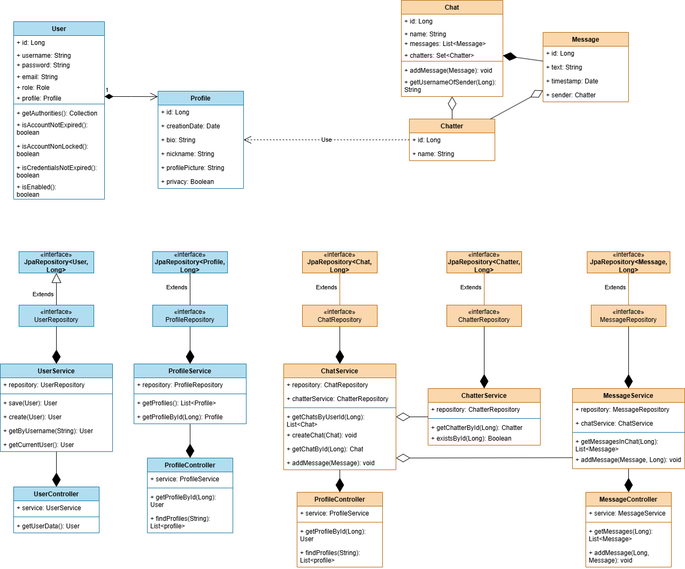

# Диаграмма классов

## Глоссарий

| Класс               | Описание                                            |
|:--------------------|:----------------------------------------------------|
| `User`              | Класс пользователя                                  |
| `Profile`           | Класс профиля пользователя                          |
| `Chat`              | Класс чата, между пользователями                    |
| `Message`           | Класс сообщения                                     |
| `Chatter`           | Класс участника чата, связан с данными пользователя |
| `UserService`       | Класс, реализующий бизнес-логику пользователей      |
| `UserRepository`    | Интерфейс для работы с базой данных пользователей   |
| `ChatService`       | Класс, реализующий бизнес-логику чатов              |
| `ChatRepository`    | Интерфейс для работы с базой данных чатов           |
| `MessageService`    | Класс, реализующий бизнес-логику сообщений          |
| `MessageRepository` | Интерфейс для работы с базой данных сообщений       |
| `ChatterService`    | Класс, реализующий бизнес-логику участников чата    |
| `ChatterRepository` | Интерфейс для работы с базой данных участников чата |
