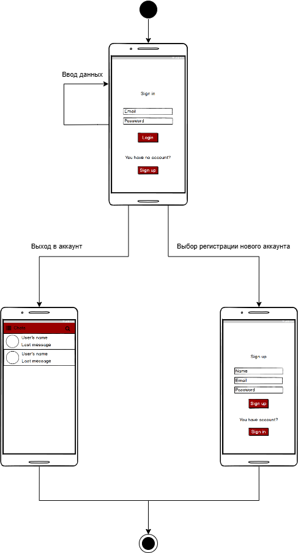
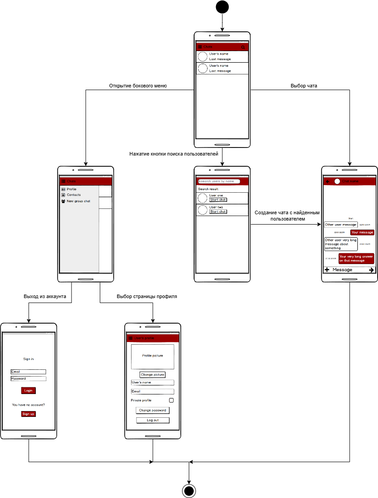
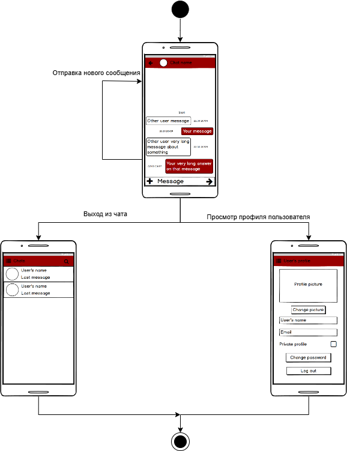

# Диаграммы состояний

## Содержание

1. [Вход в аккаунт](#login)
2. [Чаты](#chat)
3. [Сообщения](#messages)

---

<a name="login"/>

## 1. Вход в аккаунт

---

<a name="chat"/>

## 2. Регистрация

---

<a name="view_menu"/>

## 3. Просмотр главного меню

