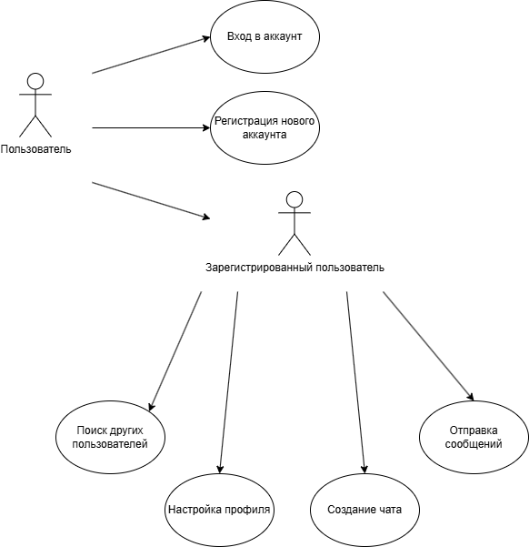

# Диаграмма вариантов использования

# Глоссарий

| Термин                            | Определение                                     |
|-----------------------------------|-------------------------------------------------|
| `Пользователь`                    | Человек, который начал использовать приложение. |
| `Зарегистрированный пользователь` | Пользователь, который имеет аккаунт             |

# Поток событий

# Содержание

1. [Актеры](#actors)
2. [Варианты использования](#use_case)
    - [Зарегистрироваться](#register)
    - [Войти в аккаунт](#login)
    - [Создание нового чата](#new_chat)
    - [Отправка сообщения](#send_msg)
    - [Редактировать профиль](#change_profile)
    - [Поиск других пользователей](#find_users)

<a name="actors"/>

# 1 Актёры

| Термин                            | Определение                                            |
|-----------------------------------|--------------------------------------------------------|
| `Пользователь`                    | Человек, который начал использовать приложение.        |
| `Зарегистрированный пользователь` | Пользователь, ранее зарегистрировавшийся в приложении. |

<a name="use_case"/>

# 2 Варианты использования

<a name="login"/>

## 2.1 Войти в аккаунт

**Описание.** Позволяет пользователю войти в аккаунт.  
**Предусловия.** Пользователь захотел войти в приложение.

**Основной поток.**
1. Приложение отображает страницу входа в аккаунт;
2. Пользователь вводит данные;
3. Пользователь нажимает кнопку "Вход";
4. Приложение проверяет валидность введённых данных;
5. Если данные верны, приложение переходит на страницу чатов пользователя;
6. Если данные не верны, пользователь получает сообщение об ошибке;
7. Вариант использования завершается.

<a name="register"/>

## 2.2 Регистрация

**Описание.** Регистрация позволяет пользователю создать свой аккаунт в приложении.  
**Предусловия.** Пользователь, у которого нет аккаунта, хочет создать новый аккаунт.

**Основной поток.**
1. Приложение переходит на страницу регистрации;
2. Пользователь вводит необходимые данные;
3. Пользователь подтверждает ввод;
4. Приложение проверяет корректность данных;
5. Если данные верны, приложение пытается зарегистрировать данные пользователя в БД;
6. Если данные не верны или запрос не успешный пользователю выводится сообщение об ошибке;
7. Если запрос о регистрации успешен, приложение переходит на страницу чатов нового пользователя;
8. Вариант использования завершается;

<a name="new_chat"/>

## 2.3 Создание чата

**Описание.** Позволяет пользователю создать новый чат с другим пользователем.  
**Предусловия.** Зарегистрированный пользователь хочет создать чат с другим пользователем.

**Основной поток.**
1. После успешной авторизации пользователя, приложение отображает страницу чатов пользователя;
2. Пользователь нажимает кнопку поиска и вводит имя другого пользователя;
3. Приложение получает список найденных пользователей по имени и отображает на странице;
4. Пользователь нажимает кнопку "Начать чат" рядом с нужным пользователем.
5. Приложение делает запрос о создании чата между данными пользователями.
6. Если запрос успешен приложение переходит на страницу сообщений нового чата.
7. Если ответ сообщает об ошибке, пользователю выводится сообщение об ошибке создания чата.
8. Вариант использования завершается;

<a name="send_msg"/>

## 2.4 Отправка сообщения

**Описание.** Позволяет отправить сообщение в чат.  
**Предусловия.** Зарегистрированный пользователь захотел отправить сообщение другому пользователю.

**Основной поток.**
1. После успешной авторизации пользователя, приложение отображает страницу чатов;
2. Пользователь выбирает чат в который хочет отправить сообщение;
3. Приложение переходит на страницу сообщений выбранного чата;
4. Приложение получает список сообщений выбранного чата.
5. Пользователь вводит сообщение и нажимает кнопку отправить.
6. Приложение делает запрос о добавлении нового сообщения.
7. Если запрос успешный, сообщение добавляется в список сообщений чата.
8. Вариант использования завершается;

<a name="change_profile"/>

## 2.5 Редактировать профиль

**Описание.** Позволяет пользователю изменить свой профиль.  
**Предусловия.** Зарегистрированный пользователь захотел изменить профиль, который отображается другим пользвателям.

**Основной поток.**
1. После успешной авторизации пользователя, приложение отображает страницу чатов; 
2. Пользователь открывает боковое меню с помощью кнопки или свайпом вправо.
3. Пользователь выбирает перейти на страницу профиля.
4. Пользователь нажимает кнопку "Редактировать".
5. Пользователь редактирует поля профиля и нажимает кнопку "Применить".
6. Приложение делает запрос об обновлении профиля пользователя.
7. Если ответ успешен, приложение обновляет страницу профиля.
8. Если запрос неудачный, пользователь получает сообщение об ошибке.
9. Вариант использования завершается;

<a name="find_users"/>

## 2.6 Поиск других пользователей

**Описание.** Позволяет зарегистрированному пользователю найти других пользователей приложения. 
**Предусловия.** Зарегистрированный пользователь захотел посмотреть профиль другого пользователя или найти другого пользователя.

**Основной поток.**
1. После успешной авторизации пользователя, приложение отображает страница чатов;
2. Пользователь нажимает кнопку поиска.
3. Пользователь вводит имя другого пользователя.
4. Приложение делает запрос для получения списка найденных пользователей.
5. Пользователь выбирает профиль, который он хочет посмотреть.
6. Приложение получает профиль выбранного пользователя.
7. Приложение переходит на страницу профлия выбранного пользователя.
8. Вариант использования завершается;
